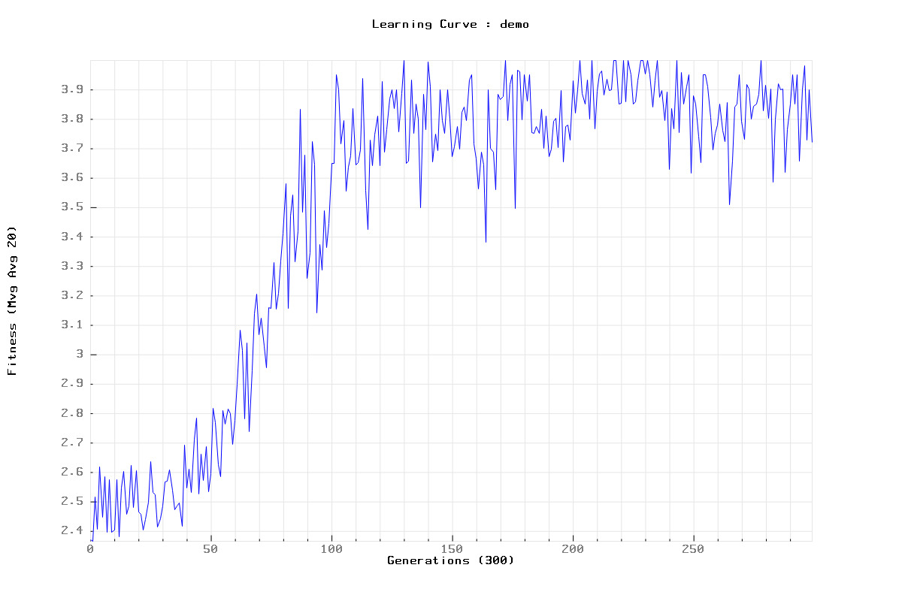

### [C++] Simple XOR PROBLEM with NEAT

- The NeuroEvolution of Augmenting Topologies (NEAT) User Page: http://www.cs.ucf.edu/~kstanley/neat.html
- MarI/O - Machine Learning for Video Games (SethBling): https://www.youtube.com/watch?v=qv6UVOQ0F44 
- NEAT-Python documentation XOR example: https://neat-python.readthedocs.io/en/latest/xor_example.html

****

### Run

`cd bin`
- **Install**: `sudo apt-get update && apt-get install g++ cmake valgrind` or `./make.sh`  
- **Memcheck**: `./build.sh -D && ./compile.sh && ./memcheck.sh -g 15 -p 15`  
- **Debug**: `./build.sh -D && ./compile.sh && ./run.sh -g 300 -p 150 -l plt -s sav`  
- **Release**: `./build.sh -R && ./compile.sh && ./run.sh -g 300 -p 150 -l plt -s sav`  

```
usage: apps/exec [-h] [-g GEN] [-p POP] [-l PLT] [-s SAV]

NEAT XOR

optional args:
  -h      Print help and exit
  params:
  -g GEN  Set generation number
  -p POP  Set population size
  utils:
  -l PLT  Set plot log file name
  -s SAV  Set save sav file name
```
> Hyperparameter configuration file: `include/env/conf.hpp`

****

### Demo

`cd bin && ./app.sh`

```
-------------------------------TRAIN-------------------------------
```



```
-------------------------------EVAL--------------------------------

EPOCH   : 1 / 10
SUCCESS : 4 / 4
RATE    : 1
MVG AVG : 4
   |  X  | Y | H |
---|-----|---|---|
#1 | 1 0 | 1 | 1 |
#2 | 0 0 | 0 | 0 |
#3 | 1 1 | 0 | 0 |
#4 | 0 1 | 1 | 1 |
------------------

EPOCH   : 2 / 10
SUCCESS : 4 / 4
RATE    : 1
MVG AVG : 4
   |  X  | Y | H |
---|-----|---|---|
#1 | 0 0 | 0 | 0 |
#2 | 1 1 | 0 | 0 |
#3 | 1 0 | 1 | 1 |
#4 | 0 1 | 1 | 1 |
------------------

EPOCH   : 3 / 10
SUCCESS : 4 / 4
RATE    : 1
MVG AVG : 4
   |  X  | Y | H |
---|-----|---|---|
#1 | 1 0 | 1 | 1 |
#2 | 1 1 | 0 | 0 |
#3 | 0 1 | 1 | 1 |
#4 | 0 0 | 0 | 0 |
------------------

EPOCH   : 4 / 10
SUCCESS : 4 / 4
RATE    : 1
MVG AVG : 4
   |  X  | Y | H |
---|-----|---|---|
#1 | 1 1 | 0 | 0 |
#2 | 0 1 | 1 | 1 |
#3 | 0 0 | 0 | 0 |
#4 | 1 0 | 1 | 1 |
------------------

EPOCH   : 5 / 10
SUCCESS : 4 / 4
RATE    : 1
MVG AVG : 4
   |  X  | Y | H |
---|-----|---|---|
#1 | 0 1 | 1 | 1 |
#2 | 1 0 | 1 | 1 |
#3 | 1 1 | 0 | 0 |
#4 | 0 0 | 0 | 0 |
------------------

EPOCH   : 6 / 10
SUCCESS : 4 / 4
RATE    : 1
MVG AVG : 4
   |  X  | Y | H |
---|-----|---|---|
#1 | 1 0 | 1 | 1 |
#2 | 1 1 | 0 | 0 |
#3 | 0 0 | 0 | 0 |
#4 | 0 1 | 1 | 1 |
------------------

EPOCH   : 7 / 10
SUCCESS : 4 / 4
RATE    : 1
MVG AVG : 4
   |  X  | Y | H |
---|-----|---|---|
#1 | 0 0 | 0 | 0 |
#2 | 1 0 | 1 | 1 |
#3 | 1 1 | 0 | 0 |
#4 | 0 1 | 1 | 1 |
------------------

EPOCH   : 8 / 10
SUCCESS : 4 / 4
RATE    : 1
MVG AVG : 4
   |  X  | Y | H |
---|-----|---|---|
#1 | 1 1 | 0 | 0 |
#2 | 0 0 | 0 | 0 |
#3 | 1 0 | 1 | 1 |
#4 | 0 1 | 1 | 1 |
------------------

EPOCH   : 9 / 10
SUCCESS : 4 / 4
RATE    : 1
MVG AVG : 4
   |  X  | Y | H |
---|-----|---|---|
#1 | 0 0 | 0 | 0 |
#2 | 0 1 | 1 | 1 |
#3 | 1 0 | 1 | 1 |
#4 | 1 1 | 0 | 0 |
------------------

EPOCH   : 10 / 10
SUCCESS : 4 / 4
RATE    : 1
MVG AVG : 4
   |  X  | Y | H |
---|-----|---|---|
#1 | 1 0 | 1 | 1 |
#2 | 1 1 | 0 | 0 |
#3 | 0 0 | 0 | 0 |
#4 | 0 1 | 1 | 1 |
------------------

Time: 0.368649ms
```

@romainducrocq
